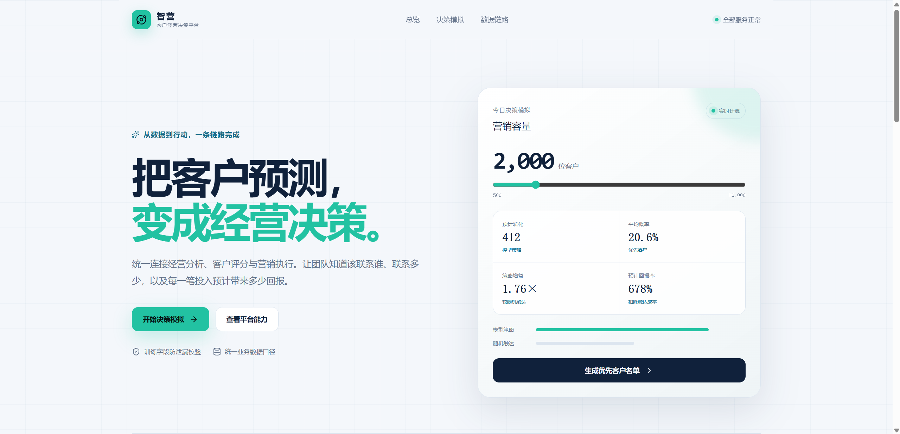
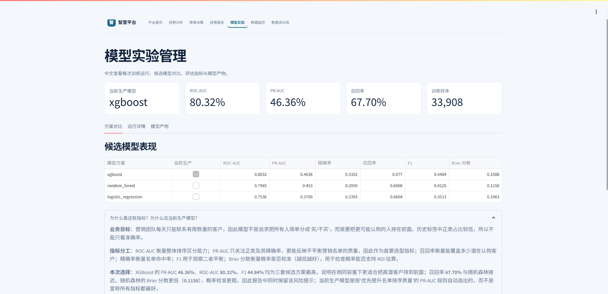
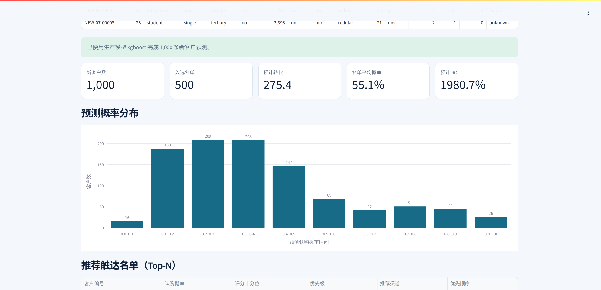

# 智营客户经营决策平台

面向银行营销场景的数据分析与客户经营演示平台，覆盖历史分析、认购概率预测、有限容量优先触达、模型实验、数据监控和数据流水线。

## 项目解决的问题

营销团队每天只能联系有限数量的客户。本平台使用历史营销记录训练概率模型，为新客户输出认购概率、优先级和 Top-N 触达名单，帮助判断客户价值、预计转化、营销容量和模型可靠性。

## 功能页面

| 页面 | 地址 | 作用 |
| --- | --- | --- |
| 平台首页 | http://localhost:3000/ | 项目概览、数据闭环、数据说明 |
| 经营分析 | http://analytics.localhost/ | 客户、渠道、活动和转化趋势 |
| 营销决策 | http://decision.localhost/ | 上传或模拟新客户并生成优先名单 |
| 经营报告 | http://report.localhost/ | 管理层摘要、客户分析和建议 |
| 模型实验 | http://experiments.localhost/ | 训练记录、指标和模型产物 |
| 数据监控 | http://monitor.localhost/ | 数据质量与漂移结论 |
| 技术监控明细 | http://monitor.localhost/evidently | 当前批次与参考样本明细 |
| 数据流水线 | http://pipeline.localhost/ | 数据处理和编排任务 |

### 指标与模型选择

成功认购属于少数类，不能只看准确率。ROC-AUC 看整体排序区分能力；PR-AUC 看正类排序和名单命中质量；Precision 看名单命中率；Recall 看潜在客户覆盖率；F1 看 Precision 与 Recall 的平衡；Brier 分数看概率校准，越低越好。

本项目以“有限触达容量下提升高潜客户排序质量”为目标，优先看 PR-AUC，同时参考 ROC-AUC、F1、Recall 和 Brier。真实结果中，XGBoost 的 PR-AUC **46.36%**、ROC-AUC **80.32%**、F1 **44.84%** 均为候选方案最高，因此选择为生产模型。随机森林的 Brier 分数更低，概率校准更稳，作为备选保留。模型实验页面提供了完整的指标解释。

模型实验页还提供两种评估方式的对照：随机分层切分使用 75% 训练、25% 测试；按时间切分使用 1–7 月训练、8–12 月测试。同一组模型和特征分别训练，便于判断随机切分是否高估未来月份效果。原始数据不含年份，因此时间切分属于按月份顺序的外推近似实验，并非严格跨年度回测。

## 数据来源与原始字段

`data/raw/bank-full.csv` 是随项目本地化保存的公开银行营销历史记录，共 **45,211** 条样本。每行代表一次客户营销联系，`y` 表示活动后是否认购定期存款。

字段包括：`age` 年龄、`job` 职业、`marital` 婚姻状态、`education` 教育程度、`default` 违约记录、`balance` 账户余额、`housing` 住房贷款、`loan` 个人贷款、`contact` 联系渠道、`day` 联系日、`month` 联系月份、`campaign` 本次联系次数、`pdays` 距上次联系天数、`previous` 历史联系次数、`poutcome` 上次活动结果、`y` 是否认购、`duration` 通话时长。

`duration` 是通话结束后才知道的字段，使用它会造成数据泄露。因此流水线和决策页都明确不使用它。

## 一键启动

要求：Docker Desktop，建议为 Docker 分配 6 GB 以上内存。执行：`docker compose up --build`。首次启动会自动初始化数据库、导入数据、构建特征、训练逻辑回归/随机森林/XGBoost、评估并选择生产模型、生成全量评分，然后启动业务页面。数据已准备好时会跳过重复训练。

## 模型训练代码

训练入口：`services/pipeline/cli.py`。核心代码：`services/pipeline/dataset.py`（导入、清洗、特征构建）、`services/pipeline/modeling.py`（训练、评估、模型选择、评分）、`services/pipeline/db.py`（数据库）、`services/decision_engine.py`（新批次字段对齐和排序）。

重新训练完整流程：`docker compose run --rm data-pipeline python -m services.pipeline.cli run-all`。

也可依次执行 `init-db`、`load-data`、`build-features`、`train`、`score` 五个子命令。

## 新客户预测

打开 `http://decision.localhost/`，可模拟批次或上传 CSV。上传文件必须包含原始字段：`age,balance,campaign,pdays,previous,day,month,job,marital,education,default,housing,loan,contact,poutcome`。不需要上传 `y` 和 `duration`。

系统会校验字段、映射月份、按训练顺序重排特征、调用生产模型，输出认购概率、评分十分位、优先级、推荐渠道和 Top-N 名单，并估算预计转化、成本、收益和 ROI。示例文件：`data/examples/decision-upload-sample.csv`。

## 目录结构

`app/` 首页；`services/pipeline/` 数据处理和模型训练；`services/decision.py` 新客户预测；`services/experiments_public.py` 模型实验；`services/monitoring/` 监控 API；`warehouse/sql/` 数仓 SQL；`data/raw/` 原始数据；`tests/` 测试；`docker-compose.yml` 一键编排。

## 测试与注意事项

运行 `pytest -q`、`docker compose config --quiet`、`docker compose ps` 检查代码和服务状态。本项目用于本地演示和面试展示，不构成真实金融授信或营销建议；上传 CSV 只在本机 Docker 环境处理。仓库不依赖外部项目地址或在线服务。更换数据集时请保持字段语义一致，并重新执行完整训练。
